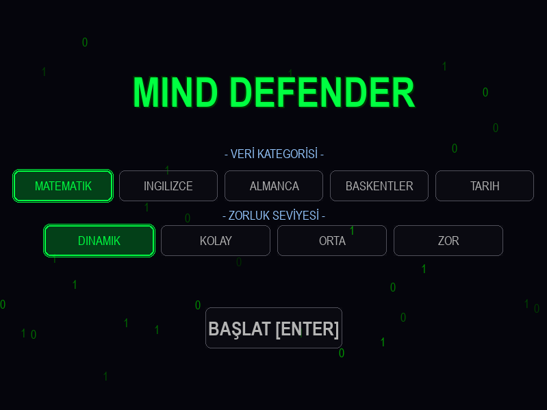
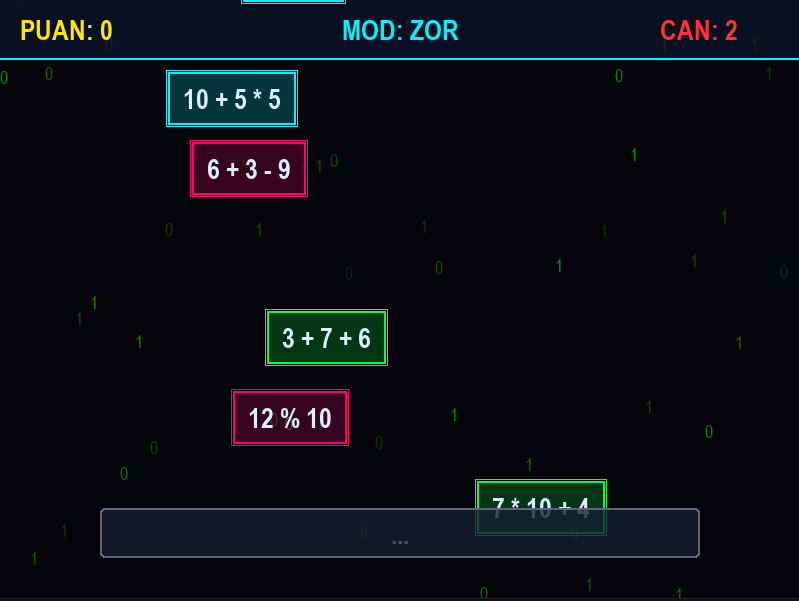

# 🧠 Mind Defender

**Mind Defender**, cyberpunk temalı, "matrix" tarzı görsellere sahip, eğitici bir klavye/yazma oyunudur. Düşen sorular yere çarpmadan önce doğru cevapları yazarak "düşmanları" yok etmeniz gerekir. Hem yazma hızınızı hem de genel kültürünüzü test edin!

## 🌟 Özellikler

*   **Cyberpunk Görsel Stil**: Neon renkler, Matrix tarzı dijital yağmur efekti ve parlak arayüz elemanları.
*   **Çeşitli Kategoriler**:
    *    Matematik
    *    İngilizce
    *    Almanca
    *    Başkentler
    *    Tarih
*   **Dinamik Zorluk Sistemi**: Puanınız arttıkça oyun hızlanır ve sorular zorlaşır. Ayrıca sabit (Kolay, Orta, Zor) modlar da mevcuttur.
*   **Gelişmiş Mekikler**: Düşmanların üst üste binmesini engelleyen akıllı spawn sistemi.

## 📸 Ekran Görüntüleri

  
  

---
